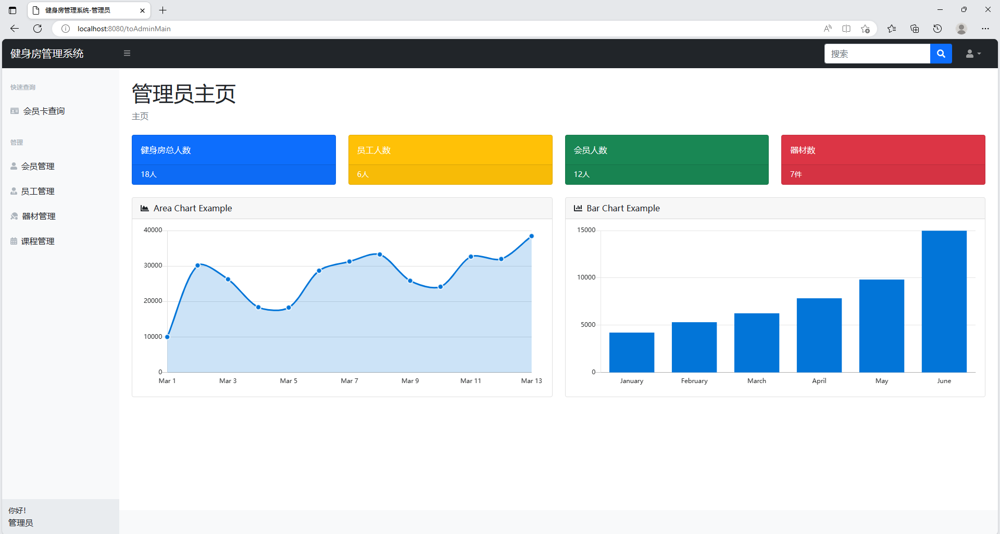
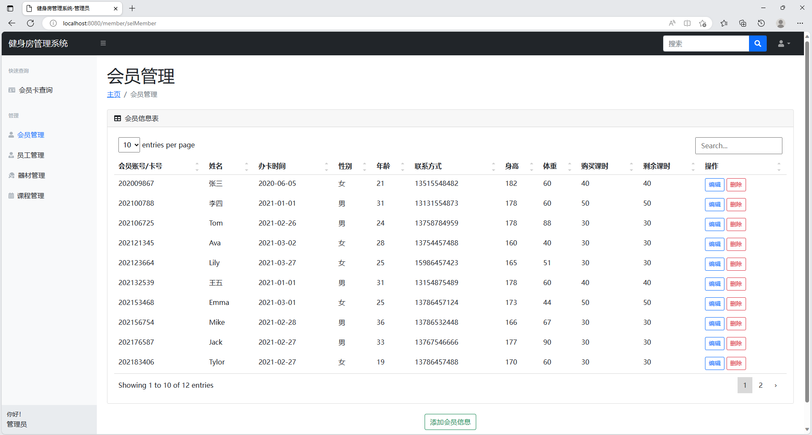
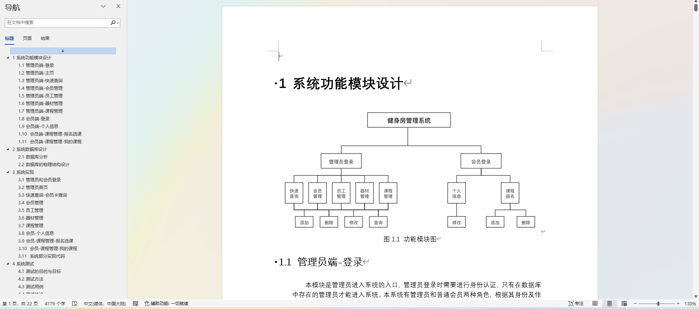

# 健身房管理系统

## 一、介绍

运行环境:idea或eclipse 数据库:mysql

开发语言：java

基于springboot+MyBatis的健身房管理系统，分管理员和会员登录

管理员端：会员管理，会员卡查询，员工管理，器材管理，课程管理

会员端：个人信息，课程管理

技术栈：Spring Boot、MyBatis、html、MySQL

## 二、部分页面截图展示

## 三、4200字项目文档

## 四、 9.9￥ 获取完整源码+sql，附赠4200字论文参考，需要加Q：3808981644 备用Q：3577148218

